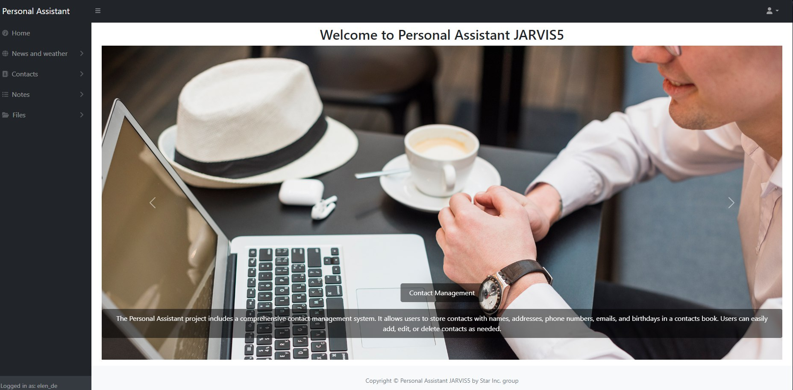
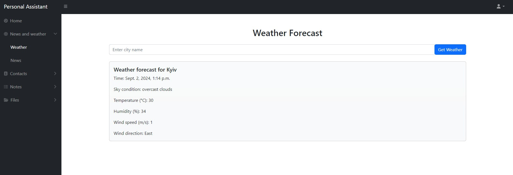
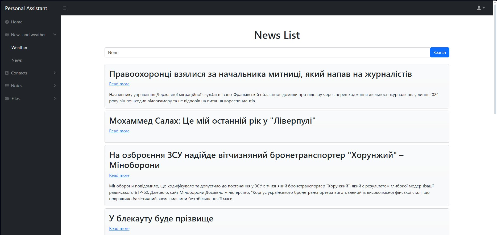

# Personal-Assistant-Django
A personal web-application built using the Django web framework.

The application allows you to store your contacts, adding notes, processing your files and getting information about weather.  
## Table of contents
* [General info](#general-info)
* [Technologies](#technologies)
* [Setup](#setup)

## General info
This is your personal virtual-assistant that helps you:
* Storing contacts with names, addresses, phone numbers, emails, and birthdates.
* Displaying a list of contacts with reminders for upcoming birthdays.
* Validating phone numbers and emails for correctness.
* Searching contacts within the contact book.
* Editing and deleting contacts.
* Storing and searching notes with textual information and the ability to add tags.
* Uploading user files to a cloud service and sorting them by categories.
* Displaying weather information.

Regarding authentication:
* Implemented user authentication mechanism with restricted access to functions.
* Ensured users only have access to their own data and files.
* Introduced mechanisms for password recovery via email.
	
## Technologies
Project is mainly based on:
* Web framework: Django
* Frontend: HTML/CSS, framework Bootstrap, JavaScript
* Backend: Python

## Setup:
* The first thing to do is to clone the repository:
```
$ git clone https://github.com/alenaporoskun/Group5_Personal_Assistant
```

Activate your virtual environment and install the dependencies by running the following commands:
```
$ poetry shell
(env)$ poetry install
```
* Create a .env file in the root directory of your project and populate it with key-value pairs as shown in the example below:
```
DATABASE_NAME=postgres
DATABASE_USER=postgres
DATABASE_PASSWORD=pass
DATABASE_HOST=127.0.0.1
DATABASE_PORT=5433

SECRET_KEY='key'

EMAIL_HOST=smtp.meta.ua 
EMAIL_PORT=465 
EMAIL_HOST_USER=*****@meta.ua 
EMAIL_HOST_PASSWORD=****


CLOUDINARY_NAME=name
CLOUDINARY_API_KEY=key
CLOUDINARY_API_SECRET=secret
```
  
Terminal:
```
(env)$ docker-compose up -d
(env)$ poetry run python manage.py makemigrations
(env)$ poetry run python manage.py migrate
(env)$ poetry run python manage.py runserver   
```

Open `http://127.0.0.1:8000/` in a browser. You should see the main page.
   
  

  

  

   

  

  

  

  

     
